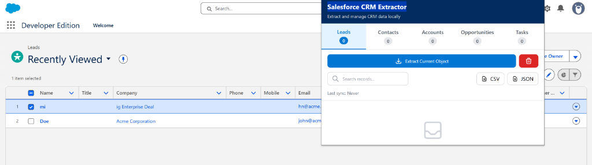
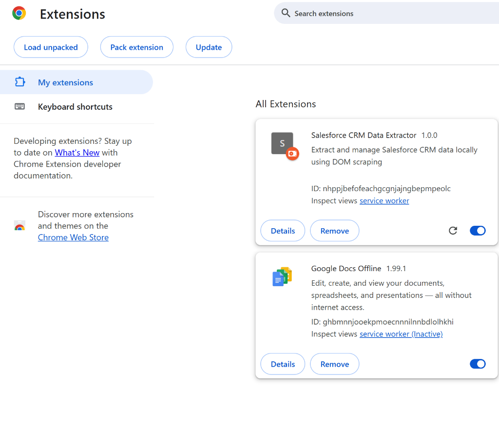

# Salesforce CRM Data Extractor

A Chrome Extension (Manifest V3) that extracts Salesforce CRM data via DOM scraping and displays it in a React dashboard.


## ✨ Features

- **5 Salesforce Objects**: Leads, Contacts, Accounts, Opportunities, Tasks
- **Smart Detection**: Automatically detects object type and view (List/Detail/Kanban)
- **Local Storage**: Data stored locally with automatic deduplication
- **Multi-tab Sync**: Real-time synchronization across browser tabs
- **Search & Export**: Search functionality with CSV/JSON export
- **React Dashboard**: Beautiful UI with Tailwind CSS
- **Stage Visualization**: Opportunities grouped by sales stage

## 📸 Screenshots

### Extension Popup UI


### Extension Installed


## 🚀 Quick Start

```bash
# 1. Clone repository
git clone https://github.com/zubair-ahmad-beigh/Salesforce-CRM-Extractor.git

# 2. Install dependencies
npm install

# 3. Build extension
npm run build

# 4. Load in Chrome
# - Open chrome://extensions/
# - Enable "Developer mode"
# - Click "Load unpacked"
# - Select the `dist` folder
```

## 🏗️ Architecture

### Tech Stack
- **Manifest V3** - Modern Chrome Extension API
- **React 18** - UI framework
- **Tailwind CSS** - Styling
- **Webpack 5** - Bundler
- **Shadow DOM** - Isolated status indicator

### Project Structure
```
src/
├── content-scripts/    # DOM extraction logic
├── service-worker/     # Background script & storage
├── popup/             # React dashboard
├── storage/           # Storage management
└── injected-ui/       # Shadow DOM indicator
```

### Message Flow
```
Popup → Service Worker → Content Script → Extract Data → 
Service Worker → Save to Storage → Broadcast to All Tabs
```

## 🔍 How It Works

1. **Object Detection**: Analyzes URL, page title, and breadcrumbs
2. **DOM Scraping**: Extracts data using multiple selector strategies
3. **Deduplication**: Uses Salesforce record IDs to prevent duplicates
4. **Storage**: Saves to `chrome.storage.local` with multi-tab sync
5. **Display**: Shows data in React dashboard with search/filter

## 💾 Storage Schema

```javascript
{
  "salesforce_data": {
    "leads": [{ id, name, company, email, ... }],
    "contacts": [...],
    "accounts": [...],
    "opportunities": [{ id, name, amount, stage, ... }],
    "tasks": [...],
    "lastSync": { leads: timestamp, ... }
  }
}
```

## 🛠️ Development

```bash
# Development mode (watch)
npm run dev

# Production build
npm run build

# Clean dist folder
npm run clean
```

## ⚠️ Known Limitations

- **DOM Fragility**: Salesforce may update their DOM structure
- **Lightning Only**: Designed for Lightning Experience (not Classic)
- **No API**: Uses DOM scraping, not Salesforce APIs
- **Storage Limit**: Chrome storage limited to ~10MB
- **Manual Extraction**: Requires user to click "Extract" button

## 🔐 Permissions

- `storage` - Store extracted data locally
- `tabs` - Query active tab
- `activeTab` - Access current page
- `scripting` - Inject content scripts
- `host_permissions` - Access Salesforce domains

## 🐛 Troubleshooting

**Extension not working?**
1. Reload extension at `chrome://extensions/`
2. Refresh Salesforce page
3. Check browser console for errors
4. Ensure you're on Lightning Experience

**No data extracted?**
1. Wait for page to fully load
2. Try navigating to a record detail page
3. Check if object type is supported

## 📝 License

MIT License

## 🤝 Contributing

Contributions welcome! Please fork, create a feature branch, and submit a PR.

---

**Built with ❤️ for Salesforce users**
